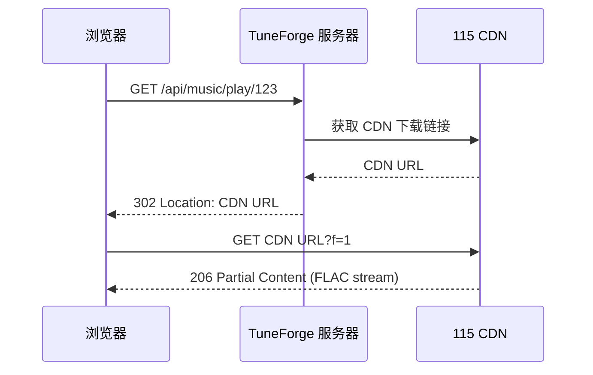
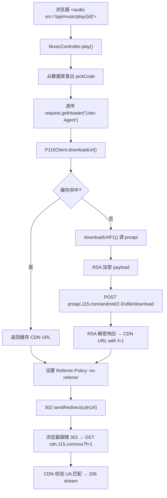
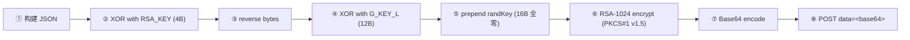
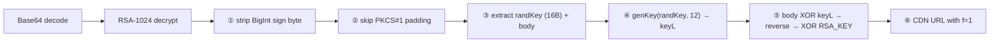
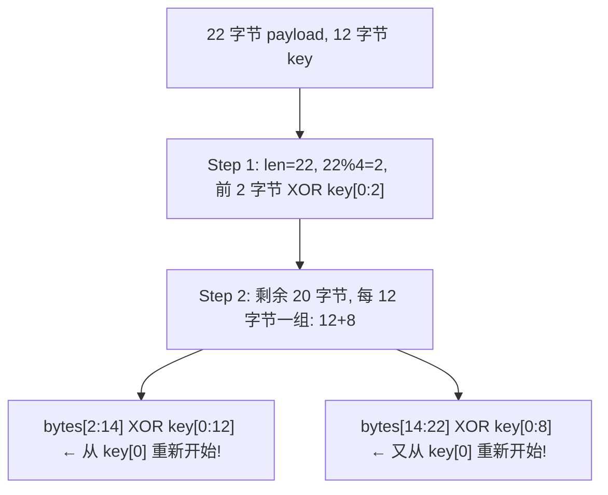

> 本文由 AI 辅助总结自 [TuneForge](https://github.com/chainlinn/TuneForge) 项目实践。

## 问题

写一个音乐播放器项目 [TuneForge](https://github.com/chainlinn/TuneForge)，音频存在 115 网盘。想让浏览器 `<audio src="...">` 直接播网盘里的 FLAC，数据不经过服务器中转。

理想的数据流是这样的：



服务端只负责"告诉浏览器去哪里拿"，实际音频数据从 CDN 直通浏览器——零服务器带宽。

但现实是，网盘的 CDN 有防盗链。

---

## 防盗链机制

115 网盘 CDN URL 长这样：

```
https://cdnfhnfile.115.com/xxx.flac?t=1234567890&f=3&k=abc123...
```

其中 `f` 参数控制校验强度：

| f 值 | 校验要求 |
|------|---------|
| `f=0` | 无限制 |
| `f=1` | 请求时 User-Agent 必须与获取 CDN URL 时一致 |
| `f=2` | 需要 Referer 匹配来源站点 |
| `f=3` | UA + Cookie 都必须与获取 CDN URL 时一致 |

旧的 `webapi.115.com/files/download` 接口返回的 CDN URL **永远是 `f=3`**。这意味着：

- 服务端用带 Cookie 的请求拿到了 CDN URL
- 浏览器拿到 URL 后自己去请求 CDN
- CDN 校验 Cookie——浏览器**不会**跨域携带 `.115.com` 的 cookie 到 `115cdn.net`
- 结果：**403 Forbidden**

### 用 f=1 就行

`f=1` 只校验 User-Agent。浏览器请求 CDN 时带的 UA 和我们获取 CDN URL 时传的 UA 一致就行——这个我们完全可以控制。

所以问题的核心变成了：**怎么拿到 `f=1` 的 CDN URL？**

---

## 寻找 f=1 接口

翻阅开源社区找到两个关键线索：

1. **[p115strmhelper](https://github.com/DDSRem-Dev/MoviePilot-Plugins/tree/main/plugins.v2/p115strmhelper)**：一个 MoviePilot 插件，用 `proapi.115.com/android/2.0/ufile/download` 拿到 f=1 的 CDN URL
2. **[p115rsacipher](https://github.com/ChenyangGao/p115client)**：115 客户端 Python 库，实现了 proapi 需要的 RSA 加密协议

proapi 接口不是随便调的——请求体需要 RSA-1024 加密，响应也需要解密。

---

## 整体架构

最终的 302 直链流程：



关键点：

- **透传 UA**：服务端用浏览器的 UA 去获取 CDN URL，而不是自己的默认 UA。这样浏览器后续请求 CDN 时 UA 自然匹配
- **no-referrer**：防止浏览器携带 Referer 头，避免触发 f=2 级别校验
- **服务端不中转数据**：`sendRedirect` 之后服务端就退场了，音频流在浏览器和 CDN 之间直传

---

## RSA 加密协议逆向

这是整个方案的技术核心。proapi 的加密/解密流程完全用纯 Kotlin 实现，零外部依赖。

### 常量

从 p115rsacipher 的 Python 源码中提取以下常量：

```kotlin
// RSA-1024 公钥
val RSA_N = BigInteger("8686980c0f5a24c4b9d43020cd2c22703ff3f450756529058b1c...", 16)
val RSA_E = BigInteger("10001", 16)

// 用于 XOR 的固定密钥
val RSA_KEY = byteArrayOf(0x8d, 0xa5, 0xa5, 0x8d)  // 4 字节
val G_KEY_L = byteArrayOf(0x78, 0x06, 0xad, 0x4c, 0x33, 0x86, 0x5d, 0x18, 0x4c, 0x01, 0x3f, 0x46)  // 12 字节
val G_KTS = byteArrayOf(0xf0, 0xe5, 0x69, 0xae, ...)  // 128 字节，用于派生解密 key
```

### 加密流程（客户端 → 服务端）



对应代码：

```kotlin
fun rsaEncrypt115(payload: String): String {
    val data = payload.toByteArray(Charsets.UTF_8)
    // ② + ③: XOR with RSA_KEY then reverse
    val tmp = xorWithKey(data, RSA_KEY)
    tmp.reverse()
    // ④: XOR body with G_KEY_L
    val body = xorWithKey(tmp, G_KEY_L)
    // ⑤: prepend 16 zero bytes
    val xorData = ByteArray(16 + body.size)
    System.arraycopy(body, 0, xorData, 16, body.size)
    // ⑥ + ⑦: RSA encrypt and Base64
    return Base64.getEncoder().encodeToString(rsaEncrypt(xorData))
}
```

RSA 加密分块（每块最多 117 字节），PKCS#1 v1.5 填充为 128 字节：

```kotlin
fun rsaEncrypt(data: ByteArray): ByteArray {
    val result = ByteArrayOutputStream()
    var offset = 0
    while (offset < data.size) {
        val chunkSize = minOf(117, data.size - offset)
        // PKCS#1 v1.5: 0x00 || 0x02[padLen] || 0x00 || message
        val padLen = 126 - chunkSize
        val padded = ByteArray(128)
        padded[0] = 0
        for (i in 0 until padLen) padded[1 + i] = 2
        padded[1 + padLen] = 0
        System.arraycopy(data, offset, padded, 2 + padLen, chunkSize)

        val intVal = BigInteger(1, padded)
        val encrypted = intVal.modPow(RSA_E, RSA_N)
        // Right-align into 128 bytes
        result.write(fixed128(encrypted.toByteArray()))
        offset += chunkSize
    }
    return result.toByteArray()
}
```

### 解密流程（服务端响应 → 明文）



对应代码：

```kotlin
fun rsaDecrypt115(cipherText: String): String {
    val cipherData = Base64.getDecoder().decode(cipherText)
    // RSA decrypt, strip sign byte
    val decrypted = rsaDecrypt(cipherData)

    // Skip PKCS#1 padding
    var pos = 0
    while (pos < decrypted.size && decrypted[pos] == 0x02.toByte()) pos++
    if (pos < decrypted.size && decrypted[pos] == 0x00.toByte()) pos++

    // Extract randKey and derive keyL
    val randKey = decrypted.copyOfRange(pos, pos + 16)
    pos += 16
    val keyL = genKey(randKey, 12)

    // Reverse encryption steps
    val body = decrypted.copyOfRange(pos, decrypted.size)
    val tmp = xorWithKey(body, keyL)
    tmp.reverse()
    return String(xorWithKey(tmp, RSA_KEY), Charsets.UTF_8)
}

fun genKey(randKey: ByteArray, skLen: Int): ByteArray {
    return ByteArray(skLen) { i ->
        val idx = i * skLen
        val lenPos = skLen * (skLen - 1) - i * skLen
        val x = ((randKey[i].toInt() and 0xff) + (G_KTS[idx].toInt() and 0xff)) and 0xff
        (G_KTS[lenPos].toInt() xor x).toByte()
    }
}
```

### RSA 解密注意：只剥离 BigInt sign byte

这是踩过的坑之一。Java/Kotlin 的 `BigInteger.toByteArray()` 会在正数前加 `0x00` sign byte。RSA 解密后得到的字节是 `[0x00][0x02]*padding[0x00][randKey:16][body]`。

Python 的做法是**只剥离第一个 0x00**（sign byte），保留 PKCS#1 填充：

```python
# Python: 只找第一个 0x00
b = to_bytes(p, exact_len)
data += memoryview(b)[b.index(0)+1:]
```

我一开始错误地剥离了全部 PKCS#1 padding（`0x00 0x02..0x02 0x00`），导致 randKey 读到了 `0x02` 开头的字节，`genKey` 派生出的 keyL 完全错误，解密结果乱码。

```kotlin
// 正确：只剥离 BigInt sign byte
fun rsaDecrypt(data: ByteArray): ByteArray {
    val decrypted = BigInteger(1, chunk).modPow(RSA_E, RSA_N)
    val decBytes = decrypted.toByteArray()
    val idx = decBytes.indexOf(0)
    val stripped = if (idx >= 0) decBytes.copyOfRange(idx + 1, decBytes.size) else decBytes
    // stripped = [0x02]*[0x00][randKey:16][body] — PKCS#1 padding still there
    return stripped
}
```

然后在 `rsaDecrypt115()` 中再单独处理 PKCS#1 padding 的跳过。

---

## XOR 的坑：chunk-aligned 分段逻辑

这是最隐蔽的 bug。Python `p115rsacipher.xor()` 的分段方式很特别：

```python
def xor(src, key):
    secret = bytearray()
    i = len(src) & 0b11           # 残留字节数 = len % 4
    if i:
        secret += bytes_xor(src[:i], key[:i])        # 残留部分用 key 前 i 字节
    for i, j, s in acc_step(i, len(src), len(key)):
        secret += bytes_xor(src[i:j], key[:s])       # 剩余按 key 长度分组，每组从 key[0] 开始
    return secret
```

以 22 字节 payload `{"pick_code":"test123"}` 和 12 字节 key 为例：



每轮分组的 key 索引都从 0 开始，不是连续递增的。我最初用 `i % keyLen` 循环，导致密钥偏移累积，整个加密结果错误。

正确实现：

```kotlin
fun xorWithKey(src: ByteArray, key: ByteArray): ByteArray {
    val result = ByteArray(src.size)
    val remainder = src.size and 3  // len & 0b11
    var pos = 0
    // 残留部分
    for (i in 0 until remainder) {
        result[pos] = (src[pos].toInt() xor key[i].toInt()).toByte()
        pos++
    }
    // 剩余按 key 长度分组，每组从 key[0] 开始
    while (pos < src.size) {
        for (i in key.indices) {
            if (pos >= src.size) break
            result[pos] = (src[pos].toInt() xor key[i].toInt()).toByte()
            pos++
        }
    }
    return result
}
```

---

## randKey 的坑：必须全零

加密时 payload 前面要 pad 16 字节的 randKey。Python 源码用的**固定全零**：

```python
xor_text = bytearray(16)          # 全零, 不是随机!
xor_text += xor(tmp, G_key_l)
```

我最初用了 `SecureRandom().nextBytes(randKey)`，结果是随机的。服务端 RSA 解密后拿到 `[randKey][body]`，用 randKey 调 `genKey` 派生 keyL 解密 body。全零 randKey 时服务端有硬编码路径直接上 `G_KEY_L`，但随机 randKey 会导致 keyL 派生不一致，解密出乱码 JSON。

修正——直接用全零：

```kotlin
val xorData = ByteArray(16 + body.size)  // Java 的 ByteArray 默认全零
System.arraycopy(body, 0, xorData, 16, body.size)
```

---

## ProAPI 调用

```kotlin
private fun downloadUrlF1(pickCode: String, cookie: String, ua: String): String? {
    val payload = """{"pick_code":"$pickCode"}"""
    val encrypted = rsaEncrypt115(payload)

    // URL encode, 注意空格转 %20 而非 +
    val formEncoded = URLEncoder.encode(encrypted, "UTF-8").replace("+", "%20")
    val body = "data=$formEncoded".toRequestBody(
        "application/x-www-form-urlencoded".toMediaType()
    )

    val request = Request.Builder()
        .url("http://proapi.115.com/android/2.0/ufile/download")
        .header("User-Agent", ua)  // 透传浏览器的 UA
        .post(body)
        .build()

    val response = client.newCall(request).execute()
    // ... 解密响应，提取 CDN URL
}
```

两个注意点：

1. **端点**是 `android/2.0/ufile/download`，不是 `app/chrome/downurl`——后者仅支持 aid=1 的 pickcode 且字段名不同（`pickcode` vs `pick_code`）
2. **User-Agent 透传浏览器的**——这是整个方案成立的前提。获取 CDN URL 时用什么 UA，浏览器请求 CDN 时也得用什么 UA

---

## OkHttp 配置

```kotlin
private val client = OkHttpClient.Builder()
    .connectTimeout(15, TimeUnit.SECONDS)
    .readTimeout(15, TimeUnit.SECONDS)
    .cookieJar(cookieJar)
    .followRedirects(false)   // 关键!
    .build()
```

**`followRedirects(false)` 很重要**。服务端调用 proapi 拿到 CDN URL 后，需要的是这个 URL 字符串本身，然后返回给浏览器。如果在服务端自动跟随了 CDN 的重定向，那就变成服务端代理下载了。

自定义 CookieJar 负责把 115 登录的 auth cookie（UID/CID/SEID/KID）注入到所有 115 相关域名的请求中，同时保留 WAF 返回的 `acw_tc` token。

---

## CDN URL 缓存

CDN URL 有有效期（约 50 分钟），同一首歌没必要每次播放都重新加密请求：

```kotlin
private data class CachedUrl(val url: String, val expireAt: Long)
private val downloadUrlCache = ConcurrentHashMap<String, CachedUrl>()

fun downloadUrl(pickCode: String, cookie: String, userAgent: String): String? {
    val cacheKey = "$pickCode:$userAgent"
    // 命中缓存直接返回
    getCachedDownloadUrl(cacheKey)?.let { return it }

    // 优先 proapi (f=1)
    val f1Url = downloadUrlF1(pickCode, cookie, userAgent)
    if (f1Url != null) {
        downloadUrlCache[cacheKey] = CachedUrl(f1Url, System.currentTimeMillis() + 50 * 60 * 1000L)
        return f1Url
    }

    // 回退 webapi (f=3, 调试用)
    // ...
}
```

注意缓存 key 包含了 `userAgent`。不同浏览器的 UA 不同，对应拿到的 CDN URL 也不同（f=1 的 URL 绑定了 UA）。

---

## Controller 层

```kotlin
@GetMapping("/play/{id}")
fun play(@PathVariable id: String, request: HttpServletRequest, response: HttpServletResponse) {
    val row = musicRepository.findById(id) ?: throw NoSuchElementException("Track not found")
    val pickCode = row.fileName.substringAfter(":")

    // 1. 透传浏览器 UA
    val browserUa = request.getHeader("User-Agent") ?: "Mozilla/5.0"

    // 2. 获取 f=1 CDN URL（优先走缓存）
    val downloadUrl = p115Client.downloadUrl(pickCode, cookie, browserUa)
        ?: throw NoSuchElementException("Download URL not available")

    // 3. 设置 no-referrer 策略
    response.setHeader("Referrer-Policy", "no-referrer")

    // 4. 302 重定向——服务端退场
    response.sendRedirect(downloadUrl)
}
```

三步走完，服务端的活就干完了。剩下的音频流传输是浏览器和 CDN 之间的事。

---

## 为什么要 302 直链而不是服务端代理？

| 方案 | 服务器带宽 | 延迟 | 
|------|----------|------|
| 服务端代理（拿流→转发） | 每字节都走服务器 | 多一跳 |
| 302 直链 | **零** | 低 |

一首 FLAC 动辄 30-50MB，同时几个人播放下服务器的带宽就吃紧了。302 方案让数据从 CDN 直通浏览器，服务端只负责那几百字节的 HTTP 响应头和 RSA 加解密——CPU 消耗几乎可以忽略不计。

---

## 总结

整个方案的核心思想是**防盗链降级**：通过逆向网盘的 proapi 加密协议，把 CDN URL 的防盗链等级从需要 Cookie 的 `f=3` 降到只需 UA 的 `f=1`，然后透传浏览器 UA 拿到 URL，302 丢给浏览器自己去拉数据。

涉及的坑：

1. **XOR chunk-aligned 分段逻辑**：残留字节单独处理，剩余按 key 长度分组且每组从 key[0] 重新开始
2. **RSA 解密只剥离 sign byte**：不要动 PKCS#1 padding，那是后面步骤的输入
3. **randKey 必须全零**：不能用随机值，否则服务端 keyL 派生不一致
4. **端点和字段名**：`android/2.0/ufile/download` + `pick_code`，不是 `app/chrome/downurl` + `pickcode`

完整实现见 [TuneForge - P115Client.kt](https://github.com/chainlinn/TuneForge/blob/main/src/main/kotlin/com/tuneforge/storage/P115Client.kt)。
